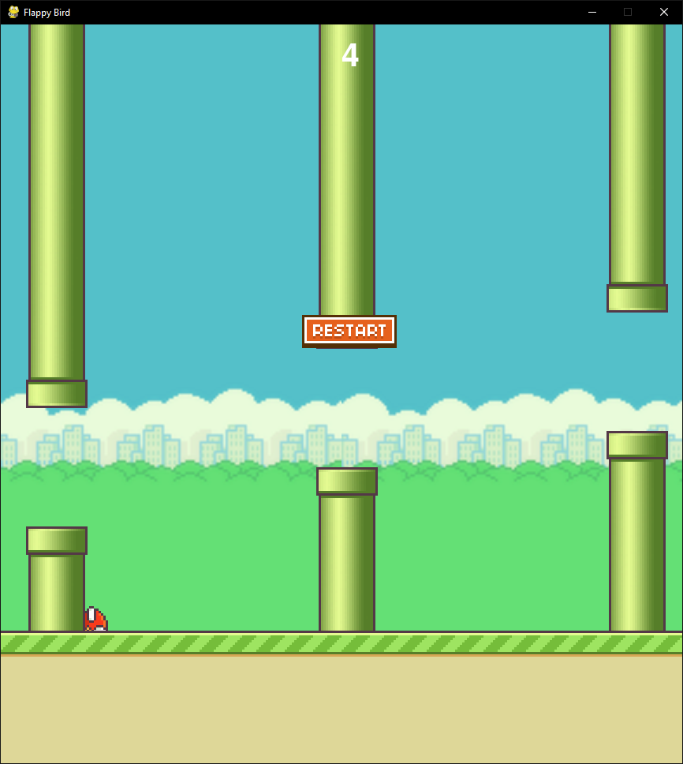

# Flappy Bird Clone

## Overview
This is a Flappy Bird clone developed using Python and Pygame. The project was created following a tutorial, with additional functionalities and code notations added to enhance clarity and improve gameplay.

## Features
- Classic Flappy Bird gameplay mechanics
- Added functionalities for improved user experience
- Clean and well-commented code for better understanding

## Requirements
- Python 3.x
- Pygame library

## Installation
1. Clone the repository:
   ```bash
   git clone https://github.com/Jastreas/Python_Pygame_FlappyBird_Clone.git
   ```
2. Navigate to the project directory:
   ```bash
   cd Python_Pygame_FlappyBird_Clone
   ```
3. Install the required dependencies:
   ```bash
   pip install pygame
   ```

## How to Play
- Run the game:
  ```bash
  python Flappy_Bird_Main.py
  ```
- **Controls:**
  - Press the **Spacebar** or click the **Left Mouse Button** to make the bird flap.
  - Click the **Restart Button** to restart the game after a game over.
- Avoid the pipes to keep the game going.
- Try to achieve the highest score possible!

## Code Structure
- `flappy_bird.py`: Main game file containing the core logic.
- `assets/`: Directory for images, sounds, and other resources.
- `README.md`: This documentation file.

## Additional Notes
- The project includes small added functionalities beyond the tutorial.
- Code is thoroughly commented to help understand each part of the game logic.

## Acknowledgments
- Based on the tutorial made by Coding With Russ [(link to tutorial)](https://www.youtube.com/watch?v=GiUGVOqqCKg&list=PLjcN1EyupaQkz5Olxzwvo1OzDNaNLGWoJ).
- Thanks to the open-source community for additional resources and inspiration.

## License
This project is open-source and available under the [MIT License](LICENSE).
